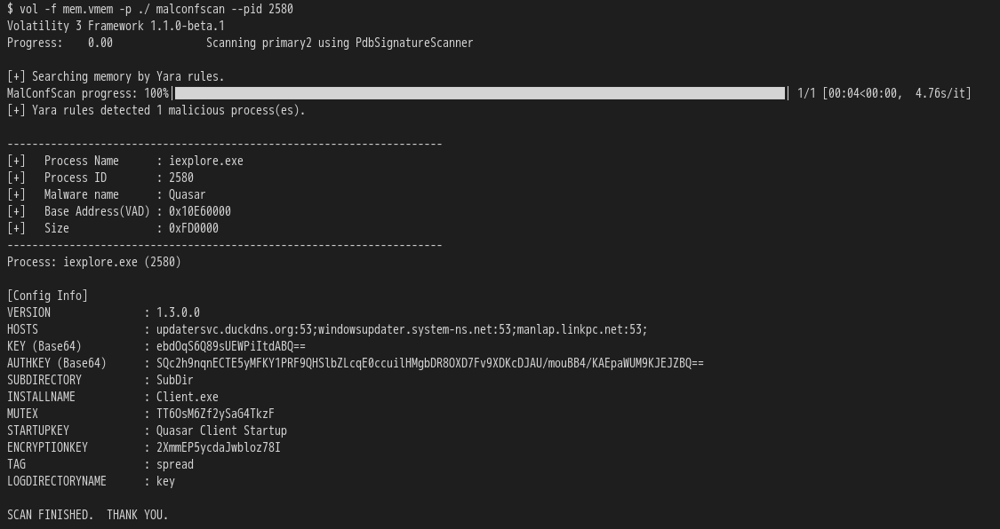

<div align="center"></div>

## Concept
 　**MalConfScan** is a [Volatility](https://github.com/volatilityfoundation/volatility) plugin extracts configuration data of known malware. Volatility is an open-source memory forensics framework for incident response and malware analysis. This tool searches for malware in memory images and dumps configuration data. In addition, this tool has a function to list strings to which malicious code refers.  

    

## Supported Malware Families
  MalConfScan can dump the following malware configuration data, decoded strings or DGA domains:

  - [x] Ursnif  
  - [x] Emotet  
  - [x] Smoke Loader    
  - [x] PoisonIvy
  - [x] CobaltStrike
  - [x] NetWire
  - [x] PlugX
  - [x] RedLeaves / Himawari / Lavender / Armadill / zark20rk
  - [x] TSCookie
  - [x] TSC_Loader
  - [x] xxmm  
  - [x] Datper  
  - [x] Ramnit  
  - [x] HawkEye  
  - [x] Lokibot
  - [x] Bebloh (Shiotob/URLZone)
  - [x] AZORult
  - [x] NanoCore RAT
  - [x] AgentTesla   
  - [x] FormBook
  - [x] NodeRAT (https://blogs.jpcert.or.jp/ja/2019/02/tick-activity.html)
  - [x] njRAT
  - [x] TrickBot
  - [ ] Pony

## Additional Analysis
  MalConfScan has a function to list strings to which malicious code refers. Configuration data is usually encoded by malware. Malware writes decoded configuration data to memory, it may be in memory. This feature may list decoded configuration data.  

## How to Install
  If you want to know more details, please check [the MalConfScan wiki](https://github.com/JPCERTCC/MalConfScan/wiki).

## How to Use
 MalConfScan has two functions **malconfscan** and **malstrscan**.

### Export known malware configuration
```
$ python vol.py malconfscan -f images.mem --profile=Win7SP1x64
```

### List the referenced strings
```
$ python vol.py malstrscan -f images.mem --profile=Win7SP1x64
```

## MalConfScan with Cuckoo
  Malware configuration data can be dumped automatically by adding MalConfScan to Cuckoo Sandbox. If you need more details on Cuckoo and MalConfScan integration, please check [MalConfScan with Cuckoo](https://github.com/JPCERTCC/MalConfScan-with-Cuckoo).
